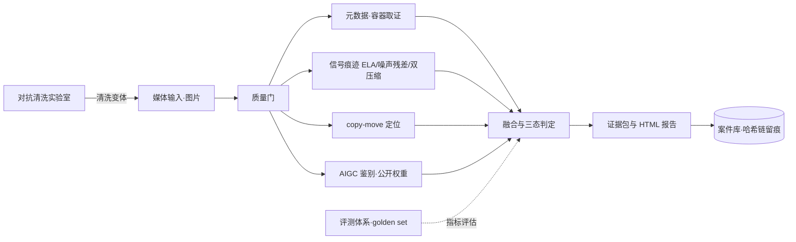

# 01 · 系统架构

## 1. 设计目标与原则

- **确定性**：同输入 + 同版本 → 同输出
- **可解释**：每个结论附痕迹、证据指针与热图
- **可留痕**：哈希链不可篡改，任何分析可回溯
- **可评测**：能力先在评测协议内定义指标，再实现
- **可插拔**：分析器为插件，可独立启停、替换、扩展

## 2. 总体架构



**数据流**：

1. 媒体输入（真实素材或清洗实验室变体）→ **质量门**
2. 质量门：格式/尺寸/可解码性检查，不满足则拒绝并记录原因
3. **分析器群**独立运行，各自输出 findings + scores + artifacts（热图/mask）
4. **融合器**归一化各迹分数 → **三态判定**（附 margin 置信度）
5. **证据包**生成：`report.json` / `report.html` / 热图与 mask 文件
6. **案件库**落盘 + **哈希链**追加（不可变）

关键设计：清洗变体走**同一条输入管线**——对抗实验室零成本接入，且保证对比公平。

## 3. 模块职责

| 模块 | 输入 | 输出 | 主要依赖 | 难点 |
|---|---|---|---|---|
| 质量门 | 文件 | 通过/拒绝 + 原因 | Pillow/OpenCV | 规则宁可保守 |
| 元数据/容器取证 | 文件 | findings（规则项） | ExifTool/piexif | 社交平台重写元数据导致误报 |
| 信号痕迹（ELA/噪声/双压） | 像素矩阵 | 热图 + 分块统计 | OpenCV/NumPy | 阈值自适应 |
| copy-move 定位 | 像素矩阵 | mask + 匹配对 | OpenCV（SIFT/ORB） | 误报控制 |
| AIGC 鉴别 | 像素矩阵 | 概率 + 模型哈希 | PyTorch（CPU） | 跨生成器泛化 |
| 融合与三态 | 各迹分数 | verdict + margin | 轻量校准 | 校准样本少 |
| 证据包 | 全部分析结果 | report.json/html + 热图 | — | 格式长期稳定 |
| 案件库 | 证据包 | 哈希链记录 | SQLite | 链规则不可变 |

## 4. 接口约定（草案）

```python
# 规划接口（W1 落地为 src/forensics/analyzers/base.py）
class Analyzer(Protocol):
    name: str        # 唯一标识，如 "metadata"
    version: str     # 语义版本，写入证据包
    def analyze(self, media: MediaRef, config: Config) -> AnalysisResult: ...

@dataclass
class AnalysisResult:
    scores: dict[str, float]
    findings: list[Finding]
    artifacts: dict[str, str]   # {"ela_heatmap": "artifacts/ela.png", ...}
    meta: dict                  # 权重哈希、参数快照（不含系统时间）
```

约定：

- 分析器不得读取系统时间参与判定（时间只进留痕 payload）
- 所有随机性从 `config.seed` 派生
- artifacts 路径以案件目录为根，相对路径入库

## 5. 确定性与版本规范

| 项 | 规则 |
|---|---|
| 随机种子 | 统一入口 `config.seed` |
| 模型权重 | 文件 SHA-256 登记（`doc/04` 表），证据包引用 |
| 输出稳定 | JSON 键排序、浮点统一格式化（如 6 位小数） |
| 配置快照 | 每次分析写入 `config_json` |
| 时间 | 不参与判定逻辑；仅作为留痕字段 |

## 6. 存储设计（SQLite + 哈希链）

```sql
cases(id, created_at, note, code_version)
media(id, case_id, path, sha256, size, mime, width, height)
analyses(id, media_id, analyzer, analyzer_version, config_json, scores_json, created_at)
findings(id, analysis_id, type, severity, detail_json, artifact_path)
chain(id, case_id, prev_hash, record_hash, payload_json, created_at)
```

**链规则**：`record_hash = SHA256(prev_hash + canonical_json(payload))`，
首条记录的 `prev_hash` 为全 0；校验脚本 `scripts/verify_chain.py` 顺序重算校验。

## 7. 代码布局（规划）

```
src/forensics/
├── __init__.py
├── models.py            # 数据模型（MediaItem / AnalysisResult / Finding）
├── store.py             # SQLite 案件库 + 哈希链
├── pipeline.py          # 运行器（质量门占位 + 分析器调度）
├── cli.py               # 命令行入口
└── analyzers/
    ├── base.py          # Analyzer 协议 + 注册表
    ├── metadata.py      # W1：元数据/容器取证
    ├── ela.py           # W2
    ├── noise.py         # W2
    ├── double_jpeg.py   # W2
    ├── copymove.py      # W3
    ├── aigc.py          # W5
    └── fusion.py        # W6
```

## 8. 关键设计决策（ADR 摘要）

| # | 决策 | 理由 |
|---|---|---|
| ADR-1 | 清洗变体走同一输入管线 | 对抗实验室零成本接入，保证对比公平 |
| ADR-2 | 经典算法优先；AIGC 仅公开权重推理 | 业余 80h 预算内不承担训练成本 |
| ADR-3 | 三态阈值先经验值，W6 用 dev 集校准 | 避免早期纠结阈值、后期无从校准 |
| ADR-4 | 分析器插件协议 | 可评测、可替换、可支撑远期扩展 |
